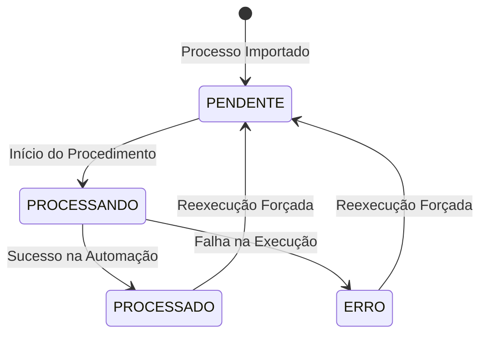

# Data Model: Gerenciador de Automações SEI Modular

**Feature**: [spec.md](file:///C:/Users/pedro.galvao/Documents/automacao-sei/specs/001-sei-modular-manager/spec.md)

## Schema SQLite (`automacao.db`)

O banco de dados armazena os metadados dos processos e o histórico de execuções para exibição e filtragem paginada na interface desktop.

### Tabela `processos`

| Campo | Tipo SQL | Restrições | Descrição |
|-------|----------|------------|-----------|
| `id` | `INTEGER` | `PRIMARY KEY AUTOINCREMENT` | Identificador único incremental |
| `numero` | `TEXT` | `UNIQUE NOT NULL` | Número único do processo SEI |
| `tipo` | `TEXT` | `NOT NULL` | Categoria/tipo do processo |
| `status` | `TEXT` | `NOT NULL` | Estado do processo (ex: `PENDENTE`, `PROCESSANDO`, `PROCESSADO`, `ERRO`) |
| `detalhes` | `TEXT` | | Informações extras de execução, logs ou traceback em caso de falha |
| `data_criacao` | `TEXT` | `NOT NULL` | Timestamp de registro no formato ISO-8601 UTC |
| `data_atualizacao` | `TEXT` | `NOT NULL` | Timestamp da última modificação no formato ISO-8601 UTC |

### Validações de Dados

- **Número do Processo**: Deve ser validado no backend garantindo formato único e não-nulo antes de inserções.
- **Status do Processo**: Deve possuir apenas valores válidos do domínio: `PENDENTE`, `PROCESSANDO`, `PROCESSADO`, `ERRO`.

### Transições de Estado de Processo

