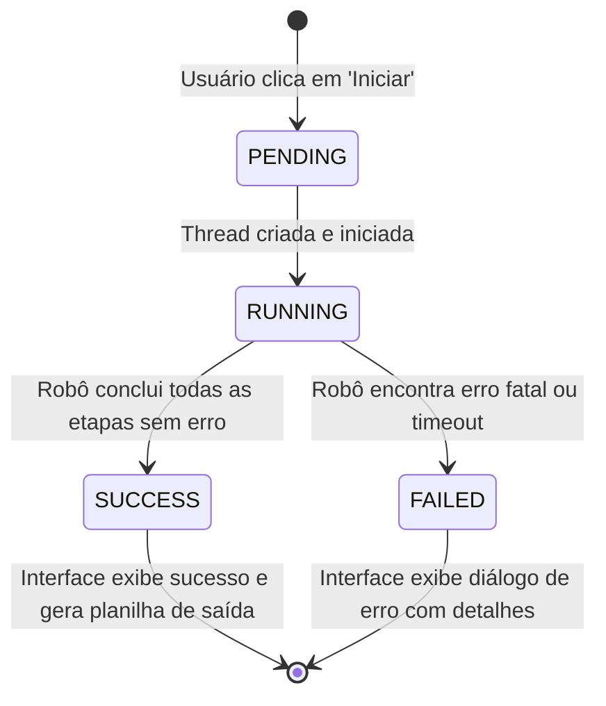

# Data Model: Interface Desktop com Plugins para Automação do SEI

Este documento descreve as entidades lógicas, dados de configuração e estruturas dinâmicas que suportam a aplicação modular de automação.

## 1. Entidades do Sistema

### Entidade: `Plugin` (Módulo de Automação)
Representa um robô de automação independente que se acopla dinamicamente à interface.
- **Campos**:
  - `id` (String): Identificador único do plugin (gerado a partir do nome da classe/arquivo).
  - `name` (String): Nome amigável de exibição na interface (ex: "Exportador de Processos do SEI").
  - `description` (String): Explicação curta sobre o que a automação faz.
  - `version` (String): Versão do plugin (ex: "1.0.0").
  - `author` (String): Autor do script.
- **Relacionamentos**:
  - Um `Plugin` possui uma lista ordenada de `InputParameter` (1 para muitos).

---

### Entidade: `InputParameter` (Parâmetro Declarativo de Entrada)
Representa uma entrada dinâmica solicitada pelo plugin para ser renderizada na interface gráfica.
- **Campos**:
  - `name` (String): Identificador interno da variável (usado no dicionário de argumentos).
  - `label` (String): Rótulo legível que aparecerá acima ou ao lado do widget.
  - `type` (String): Enumeração de tipos aceitos:
    - `"text"`: Entrada de texto livre.
    - `"password"`: Entrada de texto oculta para senhas/tokens.
    - `"file"`: Caminho para um arquivo. Exige botão auxiliar de busca.
    - `"directory"`: Caminho para uma pasta. Exige botão auxiliar de busca.
    - `"bool"`: Caixa de seleção booleana.
  - `is_required` (Booleano): Se é obrigatório preencher para iniciar a execução.
  - `default_value` (Qualquer): Valor padrão preenchido ao carregar.
  - `allowed_extensions` (Lista de Strings, opcional): Extensões de arquivos permitidas (ex: `[".xlsx", ".csv"]` se `type` for `"file"`).

---

### Entidade: `ExecutionSession` (Sessão de Execução de Automação)
Representa a execução ativa ou histórica de um plugin específico.
- **Campos**:
  - `session_id` (String UUID): Identificador da execução.
  - `plugin_id` (String): Referência ao plugin executado.
  - `status` (Enumeração):
    - `"PENDING"`: Aguardando inicialização da thread.
    - `"RUNNING"`: Robô ativamente executando ações no navegador/arquivos.
    - `"SUCCESS"`: Execução concluída com sucesso.
    - `"FAILED"`: Execução interrompida por erro fatal.
  - `start_time` (Datetime): Registro de início da execução.
  - `end_time` (Datetime): Registro de encerramento da execução.
  - `arguments_used` (Dicionário JSON): Cópia dos argumentos de entrada que foram passados na tela.
  - `output_files` (Lista de Strings): Caminhos dos arquivos de planilha Excel/CSV resultantes gerados pela execução.

---

### Entidade: `ExecutionLogLine` (Linha de Log da Execução)
Entidade de apoio para canalizar mensagens da thread de execução do robô para o widget do console do Tkinter.
- **Campos**:
  - `timestamp` (Datetime): Momento do log.
  - `level` (Enumeração): `"INFO"`, `"WARNING"`, `"ERROR"`.
  - `message` (String): Mensagem explicativa da etapa de automação.

---

## 2. Transições de Estado de uma Sessão de Execução

O diagrama a seguir descreve as mudanças de estado desde o clique de "Iniciar" pelo usuário na UI até a conclusão da tarefa:

